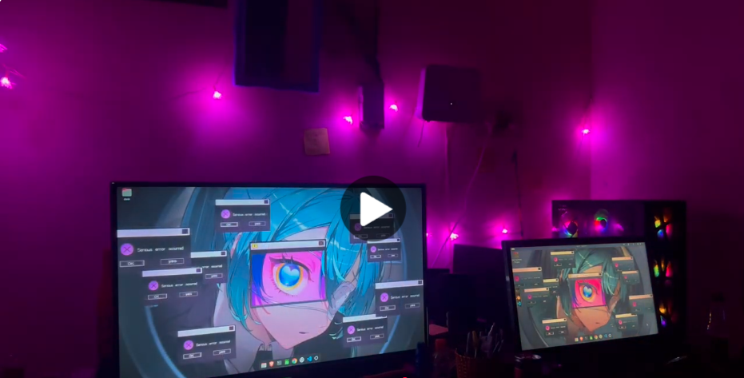

# Frames Unlock Animation

A GNOME desktop enhancement that plays frame-based animations on screen unlock, using systemd and gsettings.

## Demo

[](https://youtu.be/2zU_PhI7RyU)

---

## How it works

When you unlock your screen, a systemd user service detects the unlock event via D-Bus and runs the animation script. The script cycles through a folder of images as wallpaper frames, then restores your original wallpaper once the animation finishes.

---

## Dependencies

- GNOME desktop environment
- Python 3
- `gsettings` (included with GNOME)
- `gdbus` (included with GNOME)

---

## Install

```bash
git clone https://github.com/nitd27/frames-unlock-animation
cd frames-unlock-animation
./install.sh
```

Lock and unlock your screen to test.

---

## Uninstall

```bash
./uninstall.sh
```

---

## Change animation

Open `Frames_Unlock_Animation.py` and edit this line:

```python
FRAME_DIR = os.path.join(os.path.dirname(__file__), "frames", "Miku-eye-frames")
```

Replace `Miku-eye-frames` with the name of any folder inside `frames/`.

To add your own animation, place a folder of sequentially named `.jpg` or `.png` images inside the `frames/` directory.

---

## Available animations

| Name | Frames |
|---|---|
| Miku-eye-frames | 36 |

More coming soon.

---

## Adjust speed

In `Frames_Unlock_Animation.py`, change this value:

```python
FRAME_DELAY = 0.09  # seconds per frame
```

Lower = faster. Higher = slower.

---

## File structure

```
frames/
├── Miku-eye-frames/
│   ├── frame-001.jpg
│   └── ...
Frames_Unlock_Animation.py
frames-unlock-animation.service
install.sh
run_animation.sh
uninstall.sh
```

---

## Tested on

- Ubuntu 24.04 with GNOME
